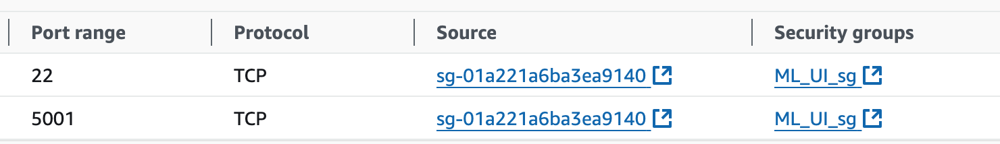
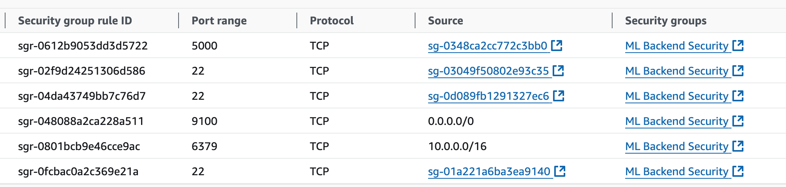
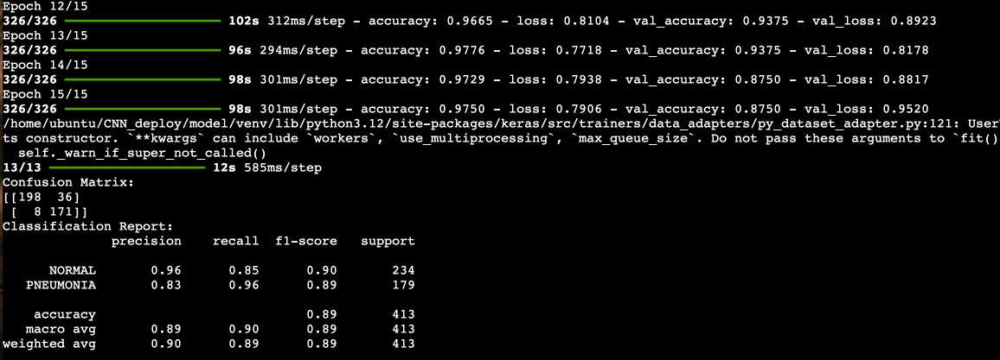
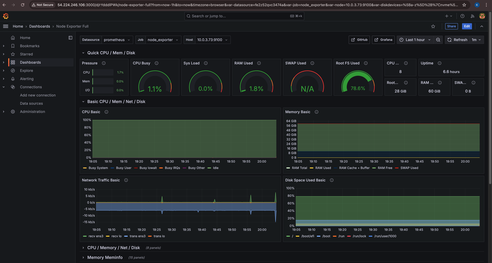
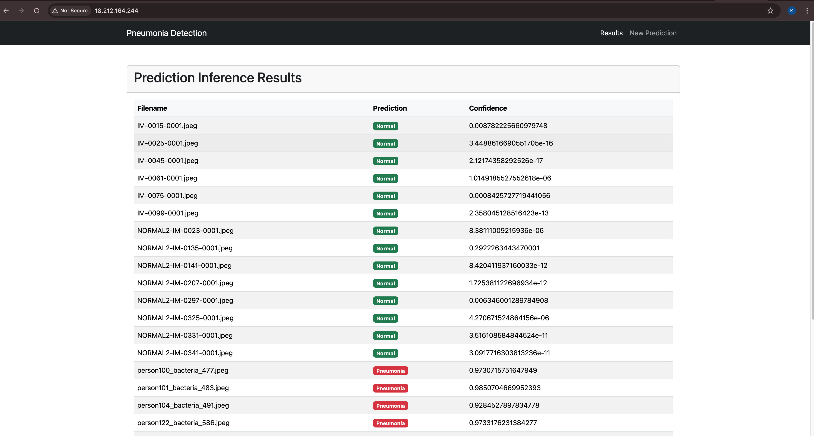

Kura Labs AI Workload 1
# Pneumonia Detection Application

## System Diagram


## Purpose
The goal of this workload is to a neural network application to detect pneumonia from X-ray images with high accuracy. The application enables doctors to upload X-rays and receive predictions on whether the scans indicate pneumonia. The backend processes the images with a model trained for pneumonia detection, while a secure, scalable infrastructure setup manages frontend, backend, and monitoring. The project includes a retraining requirement to enhance model accuracy and adjustments to system architecture to improve security by placing the backend in a private subnet and using Nginx as a reverse proxy. 

## Steps  

1.  Set up the terraform server, plan and run to create five servers. They are frontend server which installed nginx for reverse proxy, monitoring server which isntalled Grafana and Promethus to grather and display monitoring measurements and display in dashboard, backend servers contains the UI server for the web server and application server and a server for machine learning model training.   

2. Set up the servers in backend. All servers that related to the application and machine learning model will be placed into the privated subnet to secure the resource, so they will not have the public IP addressed proivided. In order to access the resource in those servers, we need to use server in the same VPC to SSH into those backend servers. Therefore, the backend server should have the `key.pem` file stored to ssh into backend.  
  
  
    A.  For the UI server, it has the gunicorn installed to get the traffic grom Nginx and communication with the application in the application server. The security group for the UI server should open the port 22 for SSH, and port 5001 for Gunicorn. 
    
      

    B. The app server contains the sources code and database (Redis). The security group should have port 22, port 6379 for Redis, port 5000 for the Gunicorn. In this server, we congiured `redis.conf` allowing other servers to connect with the database, since the database need to load data from the training server.   
      ### Application Server Setup
    **Exit the Monitoring Server and SSH into the Application Server**.
    - Execute:
      ```
      sudo reboot
      ```
    - After connecting again, in `/etc/redis/redis.conf`, modify these lines:
      ```
      bind 0.0.0.0
      protected-mode no
      ```
    - Run the following commands in the terminal:
      ```
      sudo systemctl restart redis
      ```


    

    C. The ML-training server is responsible to train the machine learning model to predict if the upload X-ray is pneumonia and connect with Redis databse in application server to futher detect pnemonia and display the  result. The security group used is same as the security group, but port 9100 should be open for node expoter. 
    
    **Instance Selection**  
     We utilized Amazon EC2 p3 instance which has GPU to help us train our model. GPU has the capability of processing multiple task in parallel and make our training process much more efficient. It also requires proper configuration for the server.   

      ### ML Training Server Configuration
      **Exit the Application Server and SSH into the ML Training Server**.
    - Navigate to `CNN_deploy/model/inference.py` and put the private IP of the Application Server where it says `backendapi_private_ip`.
      - **Question:** What connection are we making here and why?
    - In the terminal, execute the following commands:
      ```
      sudo reboot
      #### connect again ####
      cd CNN_deploy/model
      python3 -m venv venv
      source venv/bin/activate
      pip install --upgrade pip
      pip install -r requirements.txt
      python3 cnn.py
      python3 inference.py
      ```
    - Move the model (`best_model.keras`) to the application server by adding your `mykey.pem` and using SCP:
      ```
      scp -i ~/.ssh/mykey.pem /home/ubuntu/CNN_deploy/model/best_model.keras ubuntu@10.0.2.162:/home/ubuntu/CNN_deploy/pneumonia_api
      ```
    

    **Model Training**  
    The foundation model we used is ResNet50. Based on this model, we have adjust the dense layer, applied data augmentation to improve the accuracy. Meanwhile, we have applied regulatory L2 to overcome the overfitting issues. Finally the average accuracy of model achieved 90%.
     


3. Setup the servers in frontend. There are two servers and directly placed in the puclic subnet to allow access from the internet directly.   


    A.  The niginx server should have the security group open port 22 for ssh, port 443 and port 80 for HTTPs and HTTPs. It also need to be configured to direct traffic to the UUI server located in the backend.

    ### Nginx Server Configuration
    **Connect to the Nginx Server**.
      - Navigate to `/etc/nginx/sites-enabled/default`.
      - After the server listen configuration, add the following (replace `{UI_SERVER_IP}` with UI server IP):
        ```nginx
        location / {
            proxy_pass http://${UI_SERVER_IP}:5001;
            proxy_set_header Host $host;
            proxy_set_header X-Real-IP $remote_addr;
            proxy_set_header X-Forwarded-For $proxy_add_x_forwarded_for;
            proxy_set_header X-Forwarded-Proto $scheme;
        }
        ```
      - In the terminal, execute:
        ```
        sudo systemctl restart nginx
        ```
    Make sure that Nginx routes traffic correctly. 
 
    
    B. Set up the monitoring server. Proactive monitoring is very important to ensure an software have high avaliability.  Monitoring server need configure the security group to open port 22 for ssh, and port 3000 for Grafana, and port 9090 for promethus.    

    ### Monitoring Server Setup
  **Connect to the Monitoring Server**.
   - Navigate to `/opt/prometheus/prometheus.yml`.
   - Under `scrape_configs`, add the following:
     ```yaml
     - job_name: 'node_exporter'
       static_configs:
     - targets: ['${ML_TRAINING_SERVER_IP}:9100', '${ML_TRAINING_SERVER_IP}:8000']
     ```
   - In the terminal, execute:
     ```
     sudo systemctl restart prometheus
     ```
Make sure Prometheus and Grafana are configured correctly to grab information from the node exporter on the Application Server. 

    

4. Run the Gunicorn in Web server also run the Gunicorn in the app server. Go to the public IP address of Nginx, we are abloe to access the application as shown in the picture. 


    ### Application Server Final Setup
    **Exit the ML Training server and SSH back into the Application Server**.
      - Execute:
        ```
        cd ~/CNN_deploy/pneumonia_api
        python3 -m venv venv
        source venv/bin/activate
        pip install -r requirements.txt
        gunicorn --bind 0.0.0.0:5000 app:app
        ```
    Make sure that the application api is up. 

    ### Frontend Server Configuration
    **Exit the ML Training Server and SSH into the UI Server**.
      - Navigate to `CNN_deploy/pneumonia_web/app.py` and replace `API_URL` with the private IP of the Application Server.
      - In the terminal, execute:
        ```
        cd ~/CNN_deploy/pneumonia_web
        python3 -m venv venv
        source venv/bin/activate
        pip install -r requirements.txt
        gunicorn --config gunicorn_config.py app:app
        ```
    Make sure that the frontend api is up.
   
  

## Troubleshooting

**Resource issues.**  

In the working process, we have encoutered some resource shortage issue, for example, the error:  
``` Error: creating EC2 Instance: operation error EC2: RunInstances, https response error StatusCode: 400, RequestID: 85620897-0948-455c-8b52-8dd27a80a862, api error VcpuLimitExceeded: You have requested more vCPU capacity than your current vCPU limit of 0 allows for the instance bucket that the specified instance type belongs to. Please visit http://aws.amazon.com/contact-us/ec2-request to request an adjustment to this limit.```

And also no enough disk space when download the training data and reqirements. 
These problems are easy to resolve because we are using cloud services. We can choose vertical scaling to upgrade the hardware of our instance. This is one of the benefits of using cloud services.


**Security Group Setting Up Issue**

The security group for each instance is critical. The instances will only allow specified inbound traffic to the instance. I had error for the security group for UI instance, after trouble shooting, the port 5001 should be open to frontend server to allow the client to access the data. 


## Optimization

**Automation optimization**
In this workload, we didn't implement the CI/CD pipeline. The entire process from development to deployment can be automated using Jenkins.  

**Machine Learning Model**
The overall accuracy of the current model now is 90%. It can be tuned to obtain even higher accuracy to make sure the prediction as accurate as possible. 


## Conclusion  
This is my first workload to work with a machine learing application. Provided me hands-on experience with deploying and managing a machine learning application on AWS. By configuring both frontend and backend servers, along with setting up Nginx and Redis, we ensured a secure and scalable architecture. Implementing Prometheus and Grafana enabled proactive monitoring, which is crucial for high-availability applications in healthcare. Overall, this workload strengthened my understanding of MLOps, secure infrastructure, and continuous model optimization for real-world applications.
--- 
